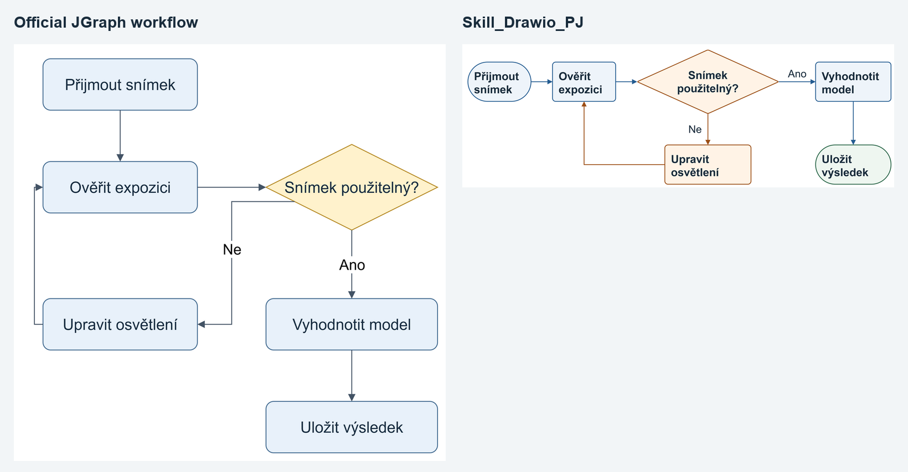
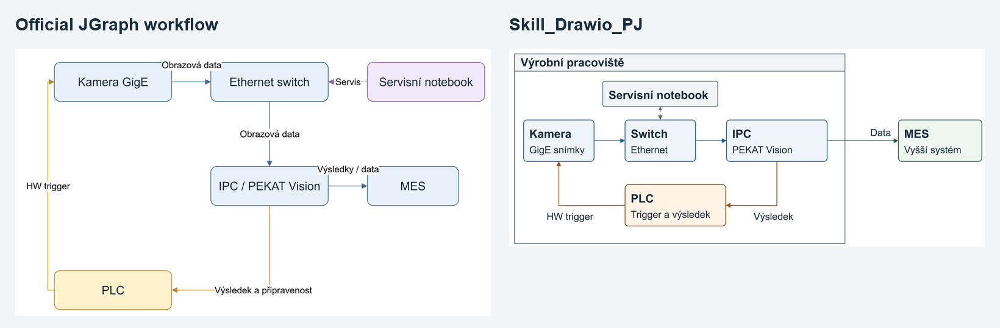
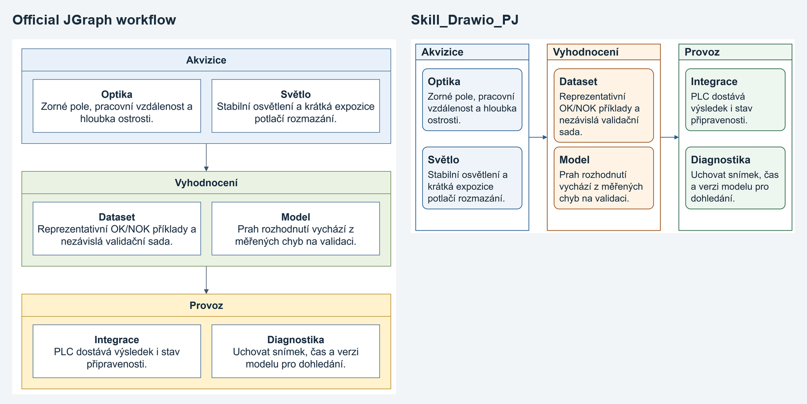

# Pilot benchmark

Measured 2026-10-07 with draw.io Desktop **31.7.0**, Python/Pillow, Playwright
Chromium and the committed sources. Three matched Czech technical tasks, nominal
Word insertion width **160 mm**, equal export settings: light theme, border 16,
PNG scale 2, embedded native XML, SVG font embedding disabled. All six native
sources and SVG/PNG exports are committed. Browser audits and source findings
are in [reports](../benchmark/reports); portable hashes/settings in export
manifests; machine-readable numbers in [metrics.json](../benchmark/metrics.json).

## Method and fairness

An independent agent received the three prompts and only the official installed
JGraph skill/references. It first used Mermaid as that skill recommends, then
performed one improvement pass using the officially supported native XML route
after inspecting unsuitable initial layouts. The **improved** outputs, not the
weaker first pass, are compared here. It could choose content sizing and explicit
placement; the baseline was not artificially forced into 140×60 boxes. It did
not read the PJ implementation or benchmark conclusions.

The installed official SKILL.md exactly matched upstream commit
`eebe7def96409a15511a51fda958f4a620c2300a` (SHA-256
`3ac312c808c20357e38d2ce3506b776ece78a7b863792d9fed958c3dd05a3eb3`).
The PJ implementation received the same semantic tasks and used measured cards,
target-aware composition, export/lint/browser audit and local visual repairs.
The root then re-exported **both** selected source sets with the same adapter.
Comparison PNGs display equal widths, top-aligned, so the height difference is
visible. Reproduce: `python scripts/benchmark.py --reexport` after installing
Desktop, Python requirements and npm/browser dependencies.

Matched content:

- Process: receive image → verify exposure → usable?; yes → evaluate → save;
  no → adjust lighting → retry verification. Six nodes, six directed edges.
- Topology: camera → switch → IPC/PEKAT → MES; PLC trigger → camera;
  IPC result → PLC; service notebook ↔ switch. Conceptual, no hardware claim.
- Dense training: acquisition (optics/light), evaluation (dataset/model),
  operation (integration/diagnostics). Six title/body cards, three real groups,
  only two group-to-group arrows; individual cards are not a forced sequence.

## Measurements

| Case | Height at 160 mm, official → PJ | Smallest rendered font, official → PJ | Linear bends, official → PJ |
|---|---|---|---|
| Process | 154.8 → **54.9 mm** (−64.5%) | 14.63 → **10.81 pt** | 4 → **1** |
| Topology | 92.2 → **67.9 mm** (−26.4%) | 8.43 → **9.19 pt** | 3 → **2** |
| Dense training | 148.7 → **82.3 mm** (−44.7%) | 11.50 → **11.02 pt** | 0 → **0** |

The improvement is spatial efficiency with readable text, fewer bends and clearer
title/body hierarchy on these cases. Process and dense text are somewhat smaller
than the baseline but remain above the 9 pt document review minimum. Topology
improves the weakest font from below to above that minimum. This is **not** a
claim that every visual dimension improved or that PJ universally beats JGraph.

Both source sets are native editable cells, not flattened images. XML IDs,
terminal references and native roots passed structural checks. All SVG/PNG
exports contain native XML; the exporter verified image signatures and embeds.
PNG + source and embedded exports provide independent practical editing paths.

Browser checks found zero edge-edge crossing findings on all six exports. PJ
has no supported-range collision, text overflow, short-terminal or small-font
warnings on the three final SVGs. Every audit retains a bounds-approximation
uncertainty. Official process retains two own-label intersections and one short
terminal warning; official topology has label/node bounding contacts, own-label
intersections, a short terminal and small-font warning. These are review findings,
not all confirmed visual defects: white edge-label backgrounds intentionally mask
lines and rectangle bounds overestimate some outlines. They must not be counted
as indisputable collision totals. Dense baseline also has no such warnings.

Native source lint marks HTML estimates/automatic routing as uncertain even when
rendered QA passes. Its conservative text estimates are not used to assert a
rendered overflow. Opaque color ratios are checked there; explicit PJ palette
meets the design thresholds. Optical contrast was also reviewed in final PNGs.
Whitespace estimates are recorded, but container bounding area is not ink density
and cannot fairly rank dense grouped layouts on its own.

## Visual review

All final individual PNGs and all three side-by-side comparisons were opened and
visually reviewed. Repairs during the PJ loop: widened decision text region,
moved the yes label off the next node, cleared the no label from its vertical
line, aligned service ports, moved control labels away from lines, and removed
unnecessary bends. Meaning and terminal inventory were retained.

## Independent forward test and limits

A reviewer used the new skill on a fresh sensor/IPC/PLC decision diagram for a
16:9 slide. It created seven native nodes and five edges, exported embedded SVG/
PNG with Desktop, ran source/browser QA and inspected a 1600×900 slide-scale
preview. Projected minimum at 300 mm was **20.52 pt**. This separately exercises
the workflow beyond the three curated recipes. Installer dependency resolution
was tested in an isolated installation and corrected before publication.

The target-context gate remains **unverified**: no actual Microsoft Word or
PowerPoint document was rendered. Projected points and slide-scale PNG are useful
evidence, not Office pagination/font-substitution proof. No physical print,
projection, hardware topology test or upstream suite was performed. SVG path
sampling/rectangular bounds, complex stencils, rotated text, MathJax and asset
availability have the documented QA limits. PDF signature/export was smoke-tested;
PDF XML recovery was not independently checked. One agent-run pilot per workflow
does not establish statistically general performance or token-cost superiority.

## V0.2 semantic generation benchmark (2026-10-07)

The three pilots were regenerated from semantic IR with coordinates, dimensions
and curated routing removed. Nine additional fixtures exercise Czech text,
industrial topology, LR/TB processes, nested groups, swimlanes, retry and document/
presentation targets. The archived official and V0.1 columns are unchanged;
V0.1 includes manual curation, whereas V0.2 here is automatic generation.

| Pilot | Official height / min font / bends | V0.1 height / min font / bends | V0.2 height / min font / bends |
|---|---|---|---|
| Process | 154.8 mm / 14.63 pt / 4 | 54.9 mm / 10.81 pt / 1 | 36.0 mm / 8.64 pt / 8 |
| Topology | 92.2 mm / 8.43 pt / 3 | 67.9 mm / 9.19 pt / 2 | 96.6 mm / 9.12 pt / 6 |
| Training | 148.7 mm / 11.50 pt / 0 | 82.3 mm / 11.02 pt / 0 | 99.2 mm / 11.83 pt / 4 |

These are width-projected SVG measurements at 160 mm, not actual printed points.
V0.2 improves process compactness and training readability against the archived official
pilots; topology trades slightly greater height for larger text, but does not consistently beat curated V0.1. More bends and label placement
are remaining weaknesses. Labels near node boundaries and short connectors still
need targeted editing; bounded label offsets deliberately flag unresolved cases
instead of moving text arbitrarily far from its edge. Audit findings are warnings
with the coverage limits above, not a count of independently confirmed defects.

All 12 native sources were exported through draw.io Desktop 31.7.0 and audited in
Chromium; all final PNGs were visually inspected. Optional external routing used
the installed official `@drawio/mcp` 1.6.3 `routeXml` implementation. Desktop 31.7.0
rejects `--layout libavoid`, so it is not claimed as that routing engine. The adapter
checks semantic/node preservation and repairs generated labels against estimated
router polylines. Those estimates still require rendered review.

Raw results, candidate penalties, review flags and export identities are in
[V0.2 metrics](../benchmark/v02/metrics.json) and adjacent per-case JSON files.
[Process](../benchmark/v02/process-comparison.png),
[topology](../benchmark/v02/topology-comparison.png) and
[training](../benchmark/v02/dense-training-comparison.png) show all three versions.
Reproduce with `python scripts/benchmark_v02.py --render`; add `--mcp-root` pointing
to an installed official package to reproduce the external routing pass.

Validation: 56 Python tests, three browser QA tests, portable package/link/hash
validation and skill metadata validation passed locally. Word insertion fixture
creation worked, but LibreOffice was unavailable; python-pptx was unavailable in
the executing interpreter. Actual Word/PowerPoint rendering remains unverified.
Slide metrics in rendered audits project to width only; layout candidate scoring
also respects slide height. Neither is an Office font-substitution test.
Efficiency numbers in [EFFICIENCY](EFFICIENCY.md) are reproducible workflow proxies,
not measured API token savings or a smaller-model performance benchmark.

## V0.3 routing benchmark (2026-10-07)

Six identical public input models run through archived v0.2.0 and current V0.3.
V0.3 includes explicit, inspectable polish: native outer retry corridor, opt-in
fan-out bus, one selected jump and verified libavoid for dense floating topology.
These are final workflow results, not a claim that raw generation alone solves every case.

| Case | Fixed endpoints V02 → V03 | Foreign-node findings V02 → V03 | Label findings V02 → V03 | Height mm V02 → V03 |
|---|---:|---:|---:|---:|
| decision-retry | 8 → 0 | 1 → 0 | 1 → 0 | 43.3 → 55.5 |
| dense-topology | 14 → 0 | 3 → 0 | 4 → 0 | 69.7 → 69.7 |
| fanout-four | 8 → 0 | 1 → 0 | 6 → 0 | 142.8 → 142.8 |
| fixed-interface | 2 → 2 | 0 → 0 | 0 → 0 | 44.7 → 44.7 |
| floating-process | 4 → 0 | 0 → 0 | 0 → 0 | 30.9 → 19.4 |
| one-crossing | 4 → 4 | 0 → 0 | 0 → 0 | 80.0 → 80.0 |

Height/font projections use a 160 mm insertion width. Findings are rectangle/path
screening, not exact shape or visual quality certificates. A diamond can produce
a bounding-box false positive. Curved/jump bends may be unknown; synthetic shared
bus geometry needs visual interpretation. Six logical inventories match exactly.
The dense topology retains one crossing. Fixed interface geometry is unchanged.
Decision is clearer but taller; fan-out is clearer without reducing height.

[Metrics and engine actions](../benchmark/v03/metrics.json); six adjacent comparison PNGs.
Probe: Desktop 31.7.0 + external @drawio/mcp 1.6.3. ELK floating-input native/SVG/PNG
smoke was also run and visually inspected; side constraints are guarded as documented.
Reproduce with `python scripts/benchmark_v03.py --baseline-root PATH --mcp-root PATH --capabilities benchmark/v03/capabilities.json --render`.
Baseline root must contain an extracted v0.2.0 tree. Optional `--cases` rechecks a subset.
Final validation: 80 Python tests, six browser SVG tests, package metadata/links/export
identity checks, independent targeted review and all six paired visual inspections.
